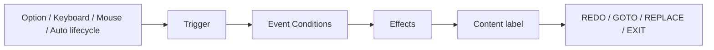

# Scene Node Editor for Ren'Py

[繁體中文](README.md) · [English](README.en.md)

Scene Node Editor is a local browser-based content editor for Ren'Py. It turns nodes, events, player options, state, and branching flow into structured, validated project data. It manages interaction rules and connections; visual design, assets, and game-specific systems remain native Ren'Py work.

> Public alpha. Currently verified with Ren'Py 8.5.3, Python 3, and macOS. The editor itself uses only the Python standard library.

## What does it manage?

| Scene Node Editor manages | The creator designs |
| --- | --- |
| Scene Nodes, the Global Node, Events, and Options | `gui.rpy`, `screens.rpy`, and HUD layouts |
| Conditions, Effects, Priority, and Weight | Images, audio, fonts, and animation assets |
| Stats, Memory Banks, and Once state | Characters, dialogue, ATL, and transforms |
| Content label references and node flow | Inventory, time, quests, and other game-specific systems |
| The GOTO / REPLACE graph and project validation | Narrative content and game design |

The editor does not overwrite creator-owned `gui.rpy`, `screens.rpy`, or other interface files, and custom screens do not replace the data-driven Options renderer.

## Five-minute start

1. Create a blank project in the Ren'Py Launcher.
2. On macOS, double-click `安裝到RenPy專案.command` in this repository.
3. Select the Ren'Py project folder or its `game/` folder.
4. In the editor, add an Option to the ROOT node, then create an Event with the same Trigger.
5. Run “Check Project”, then launch the game from Ren'Py.

A blank project gets a ROOT node and is connected to `scene_runtime_start()` when its start script is still the Ren'Py template. If the project already has a custom `label start`, the installer preserves it; add the call yourself:

```renpy
label start:
    call scene_runtime_start()
    return
```

Continue with [Build your first project](docs/en/FIRST_PROJECT.md).

## Core flow



- An Option returns a Trigger; it does not select an Event directly.
- Events own Conditions, Stat / Memory / Option Availability Effects, Content, and the flow result.
- Options may be persistent `Always` entries or `Controlled` by Effects; TEXTBOX supports whole-list and per-Item targets, and an Event may control only its own Options scope.
- Content stores a Ren'Py `label` name, not an `.rpy` filename.
- On Enter and On Exit may run several Events at node boundaries; On Node preserves the former Auto single selection.
- The fixed, undeletable Global Node provides global Events and Options. It never enters the Stack, but its Options render beside the current Scene Node's Options and may trigger or be controlled by same-scope Global Events.
- REPLACE swaps the top of the Scene Stack directly and never resumes or re-runs the parent during the transition.
- Backgrounds, audio, and transitions use native Ren'Py inside Content.
- Creators continue to own `gui.rpy` and `screens.rpy`.

## Updates and data safety

Run the installer again to update the managed editor and runtime. These creator-owned files are preserved:

```text
game/DATA/
game/GLOBALNODE/
game/SCENENODE/
game/gui.rpy
game/screens.rpy
other creator files and assets under game/
```

Node deletion is blocked while Events still reference the node. Deleted nodes are moved to `.scene-node-trash/` at the project root.

## Documentation

- [Build your first project](docs/en/FIRST_PROJECT.md)
- [Editor user guide](docs/en/USER_GUIDE.md)
- [Schema and runtime reference](docs/en/REFERENCE.md)
- [AI-assisted workflow](docs/en/AI_WORKFLOW.md)
- [繁體中文文件](README.md)
- [Development and testing](CONTRIBUTING.md)

## Other platforms

macOS has double-click installers and launchers. Other platforms currently use the manual commands:

```sh
python3 tools/install.py "/path/to/RenPyProject"
python3 "/path/to/RenPyProject/.scene-node-editor/EDITOR/app.py" \
  --project "/path/to/RenPyProject/game"
```

## License

[MIT License](LICENSE)
