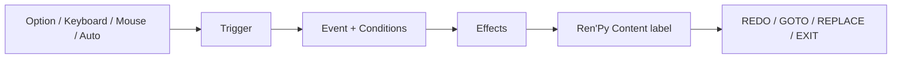

# Scene Node Editor for Ren'Py

[繁體中文](README.md) · [English](README.en.md)

A local content editor for Ren'Py game developers. Manage nodes, events, player options, state, and branching flow through visual forms while keeping narrative, presentation, and game-specific systems native to Ren'Py.

> **Public alpha** — Currently verified with Ren'Py 8.5.3, Python 3, and macOS. The editor runs locally and requires no third-party Python packages.

## What games is it for?

- Visual novels driven by choices, conditions, and numeric state.
- Simulation, raising, exploration, and branching-event games.
- Projects that need a visual way to manage many Events while authoring presentation in Ren'Py.
- Long-running projects that benefit from stable IDs, reference validation, and saved state.

## Editor and Ren'Py responsibilities

| Scene Node Editor manages | You continue to build in Ren'Py |
| --- | --- |
| Scene Nodes, the Global Node, Events, and Options | Narrative, characters, dialogue, and game design |
| Conditions, Effects, Priority, and Weight | `gui.rpy`, `screens.rpy`, and HUDs |
| Stats, Memory Banks, and Once state | Images, audio, fonts, ATL, and transforms |
| GOTO / REPLACE flow graph and validation | Inventory, time, quests, and other custom systems |

The editor does not overwrite creator-owned `gui.rpy`, `screens.rpy`, assets, or other game files.

## Get started

1. Open [Releases](https://github.com/ToNyA-369/renpy-scene-node-editor/releases), then download and extract the product ZIP whose name begins with `Scene-Node-Editor-`. Do not choose GitHub's automatically generated **Source code** archives.
2. Create a blank project in the Ren'Py Launcher.
3. On macOS, double-click `安裝到RenPy專案.command`.
4. Select the Ren'Py project folder or its `game/` folder.
5. In the editor, create an Option and an Event with the same Trigger.
6. Run **Check Project**, then launch the game from Ren'Py.

Continue with [Build your first playable project](docs/en/FIRST_PROJECT.md) to connect ROOT, an Option, an Event, and Content.

Other platforms can install and launch from a terminal:

```sh
python3 tools/install.py "/path/to/RenPyProject"
python3 "/path/to/RenPyProject/.scene-node-editor/EDITOR/app.py" \
  --project "/path/to/RenPyProject/game"
```

Install and update also sync bilingual creator documentation into `.scene-node-editor/`, so AI collaborators can read `AI_CONTEXT.md` first and consult the local User Guide or Reference without relying on network access.

## Game flow model



- An Option emits a Trigger; its Event decides conditions, state changes, presentation, and routing.
- Content is a native Ren'Py label that may use dialogue, backgrounds, audio, transitions, or custom Screens.
- The Global Node supplies cross-node Events and Options without entering the Scene Stack.
- The graph uses GOTO / REPLACE to show each node's position in the whole game.
- Stats, Memory Banks, and Controlled Options participate in Ren'Py saves.
- Project validation checks data shape and node, state, and Content references.

## Updates and data safety

Download a newer version and run the installer again to update the managed editor and runtime. These creator-owned paths remain untouched:

```text
game/DATA/
game/GLOBALNODE/
game/SCENENODE/
game/gui.rpy
game/screens.rpy
other creator files and assets under game/
```

A node cannot be deleted while an Event references it. Deleted nodes move to `.scene-node-trash/` at the project root for recovery.

## Documentation

- [Build your first playable project](docs/en/FIRST_PROJECT.md) — start from a blank Ren'Py project.
- [Editor user guide](docs/en/USER_GUIDE.md) — the seven workspaces and daily authoring.
- [Schema and runtime reference](docs/en/REFERENCE.md) — data formats and public APIs.
- [AI-assisted workflow](docs/en/AI_WORKFLOW.md) — optional game-development assistance.
- [Complete documentation index](docs/README.md) — English, Chinese, and maintenance entry points.

To modify the editor or runtime itself, start with [Contributing and testing](CONTRIBUTING.md).

## License

[MIT License](LICENSE)
