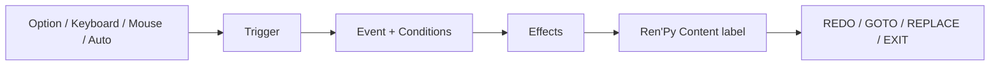

# Scene Node Editor for Ren'Py

[繁體中文](README.md) · [English](README.en.md)

給 Ren'Py 遊戲開發者使用的本機內容編輯器。用可視化表單管理節點、事件、玩家選項、狀態與分支流程，同時保留 Ren'Py 原生的劇情、畫面與演出能力。

> **Public alpha** — 目前以 Ren'Py 8.5.3、Python 3 與 macOS 驗證。Editor 僅在本機執行，且不需要額外 Python 套件。

## 適合哪些遊戲？

- 以選項、條件與數值推動流程的視覺小說。
- SLG、養成、探索或多分支事件系統。
- 希望用圖形介面管理大量 Events，但仍以 Ren'Py 撰寫演出的專案。
- 需要穩定 ID、引用檢查與可保存狀態的長期專案。

## Editor 與 Ren'Py 的分工

| Scene Node Editor 管理 | 你繼續使用 Ren'Py 完成 |
| --- | --- |
| Scene Nodes、Global Node、Events、Options | 劇情、角色、對話與遊戲設計 |
| Conditions、Effects、Priority、Weight | `gui.rpy`、`screens.rpy` 與 HUD |
| Stats、Memory Banks、Once 狀態 | 圖片、音效、字型、ATL 與 Transform |
| GOTO／REPLACE 流程圖與專案檢查 | 道具、時間、任務等專案專屬系統 |

Editor 不會覆寫創作者的 `gui.rpy`、`screens.rpy`、素材或其他遊戲文件。

## 開始使用

1. 從 GitHub 的 **Code → Download ZIP** 下載並解壓縮本專案，或使用 Git clone。
2. 使用 Ren'Py Launcher 建立一個空白專案。
3. 在 macOS 雙擊 `安裝到RenPy專案.command`。
4. 選擇 Ren'Py 專案資料夾或其中的 `game/`。
5. 在自動開啟的 Editor 中建立第一個 Option 與相同 Trigger 的 Event。
6. 執行「檢查專案」，再從 Ren'Py Launcher 啟動遊戲。

接著依照 [建立第一個可玩專案](docs/zh-TW/FIRST_PROJECT.md) 完成 ROOT、Option、Event 與 Content。

其他平台可從終端安裝與啟動：

```sh
python3 tools/install.py "/path/to/RenPyProject"
python3 "/path/to/RenPyProject/.scene-node-editor/EDITOR/app.py" \
  --project "/path/to/RenPyProject/game"
```

## 遊戲流程模型



- Option 只送出 Trigger；Event 決定條件、狀態改變、演出與後續流程。
- Content 是原生 Ren'Py label，可使用對話、背景、音訊、轉場或自訂 Screen。
- Global Node 提供跨節點 Events 與 Options，但不進入 Scene Stack。
- 關聯圖以 GOTO／REPLACE 顯示整個遊戲中的節點位置。
- Stats、Memory Banks 與 Controlled Options 會進入 Ren'Py 存檔。
- 專案檢查會驗證資料格式與節點、狀態、Content 引用。

## 更新與資料安全

下載新版後重新執行 Installer，即可更新受管理的 Editor 與 Runtime。以下創作內容不會被覆寫：

```text
game/DATA/
game/GLOBALNODE/
game/SCENENODE/
game/gui.rpy
game/screens.rpy
game/ 內其他創作者文件與素材
```

仍被 Event 引用的節點不能刪除；成功刪除的節點會移至專案根目錄的 `.scene-node-trash/`。

## 文件

- [建立第一個可玩專案](docs/zh-TW/FIRST_PROJECT.md) — 從空白 Ren'Py 專案開始。
- [Editor 使用指南](docs/zh-TW/USER_GUIDE.md) — 七個工作區與日常操作。
- [Schema 與 Runtime 參考](docs/zh-TW/REFERENCE.md) — 資料格式與公開 API。
- [AI 協作指南](docs/zh-TW/AI_WORKFLOW.md) — 選用的遊戲開發輔助流程。
- [完整文件索引](docs/README.md) — 中文、英文與維護文件入口。

要修改 Editor 或 Runtime 本身，請從 [貢獻與測試指南](CONTRIBUTING.md) 開始。

## License

[MIT License](LICENSE)
