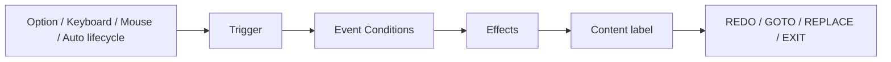

# Scene Node Editor for Ren'Py

[繁體中文](README.md) · [English](README.en.md)

Scene Node Editor 是一套在本機瀏覽器執行的 Ren'Py 內容編輯器，將節點、事件、玩家選項、狀態與分支流程整理成可驗證的結構。它負責遊戲互動的規則與連接；畫面設計、素材與專案專屬系統仍使用 Ren'Py 原生工具完成。

> Public alpha。目前以 Ren'Py 8.5.3、Python 3 與 macOS 驗證。Editor 本身只使用 Python 標準函式庫。

## 它負責什麼？

| Scene Node Editor 管理 | 創作者自行設計 |
| --- | --- |
| Scene Nodes、Global Node、Events、Options | `gui.rpy`、`screens.rpy` 與 HUD 排版 |
| Conditions、Effects、Priority、Weight | 圖片、音效、字型與動畫素材 |
| Stats、Memory Banks、Once 狀態 | 角色、對話、ATL、Transform |
| Content label 引用與節點流程 | 道具、時間、任務等專案專屬系統 |
| GOTO／REPLACE 關聯圖與專案檢查 | 劇情內容與遊戲設計 |

Editor 不會覆寫創作者的 `gui.rpy`、`screens.rpy` 或其他介面文件，也不要求以自訂 Screen 取代資料化 Options。

## 五分鐘開始

1. 使用 Ren'Py Launcher 建立一個空白專案。
2. 雙擊本 Repository 的 `安裝到RenPy專案.command`。
3. 選擇 Ren'Py 專案資料夾或其中的 `game/`。
4. 在自動開啟的 Editor 中，為 ROOT 節點新增 Option，再建立 Trigger 相同的 Event。
5. 按「檢查專案」，通過後由 Ren'Py Launcher 啟動遊戲。

空白專案會自動建立 ROOT 節點並嘗試接上 `scene_runtime_start()`。如果專案已有自訂 `label start`，Installer 不會覆寫它，請自行加入：

```renpy
label start:
    call scene_runtime_start()
    return
```

完整逐步教學請閱讀 [建立第一個專案](docs/zh-TW/FIRST_PROJECT.md)。

## 核心流程



- Option 只產生 Trigger，不直接選擇 Event。
- Event 負責 Conditions、Effects、Content 與流程結果。
- Content 保存的是 Ren'Py `label` 名稱，不是 `.rpy` 文件名。
- On Enter／On Exit 可在節點邊界依序執行多個 Events；On Node 沿用原本 Auto 的單一選擇。
- 固定且不可刪除的 Global Node 提供全局 Event 作用域；它不進入 Stack、沒有 Options，也不能使用 Option Trigger。
- REPLACE 會將 Stack 頂端直接替換為目標節點，不會恢復或重新執行父節點流程。
- 背景、音訊與轉場由 Content 使用 Ren'Py 原生語法完成。
- `gui.rpy` 與 `screens.rpy` 仍由創作者自行撰寫。

## 更新與資料安全

下載新版後重新執行 Installer 即可更新受管理的 Editor 與 Runtime。下列創作資料不會被覆寫：

```text
game/DATA/
game/GLOBALNODE/
game/SCENENODE/
game/gui.rpy
game/screens.rpy
game/ 內其他創作者文件與素材
```

刪除 Scene Node 前會檢查引用；成功刪除的節點會移至專案根目錄的 `.scene-node-trash/`。

## 文件

- [建立第一個專案](docs/zh-TW/FIRST_PROJECT.md)
- [Editor 使用指南](docs/zh-TW/USER_GUIDE.md)
- [Schema 與 Runtime 參考](docs/zh-TW/REFERENCE.md)
- [使用 AI 協助開發](docs/zh-TW/AI_WORKFLOW.md)
- [English documentation](README.en.md)
- [開發與測試](CONTRIBUTING.md)

## 其他平台

macOS 提供雙擊安裝與啟動器。其他平台目前需手動執行：

```sh
python3 tools/install.py "/path/to/RenPyProject"
python3 "/path/to/RenPyProject/.scene-node-editor/EDITOR/app.py" \
  --project "/path/to/RenPyProject/game"
```

## License

[MIT License](LICENSE)
